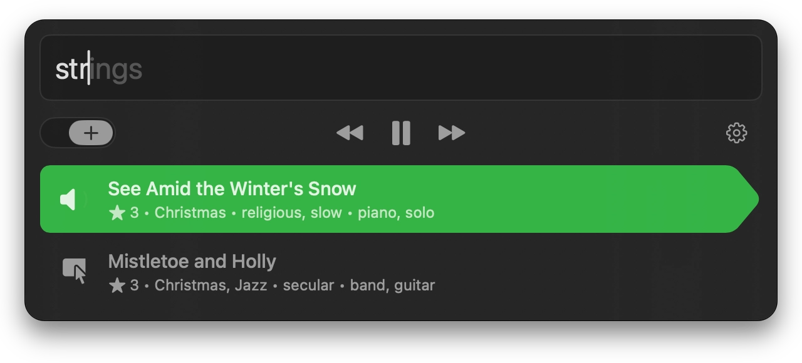

  
  <h1>Attune</h1>
  

    <b>Tag your music as it plays.</b>
  

   
   
   

Attune is a macOS music tagger app for adding keywords while you listen to your
local music library. It runs as a lightweight menu bar utility and communicates
with the system Music app via [AppleScript] and [Scripting Bridge]. It uses a
keyboard-driven overlay for fast, forgiving, unobtrusive editing.

[AppleScript]: https://developer.apple.com/library/archive/documentation/AppleScript/Conceptual/AppleScriptLangGuide/introduction/ASLR_intro.html
[Scripting Bridge]: https://developer.apple.com/documentation/scriptingbridge

  

## Features

- **At hand:** Invoke the app with a customizable global hotkey
- **Fast:** Quickly add or remove keywords or ratings
- **Forgiving:** Normalize data and prevent mistakes with a whitelist and autocomplete
- **Unobtrusive:** Edit current and selected Music tracks without switching contexts

## Install

Requires macOS 14+.

[Download] the latest release.

[Download]: https://github.com/keiranking/attune/releases/latest

## License

This project is licensed under [CC BY-NC 4.0](https://creativecommons.org/licenses/by-nc/4.0/).

You may view, modify, and redistribute the source for non-commercial
purposes only. Commercial use is not permitted without prior permission.

See the [LICENSE](LICENSE.txt) file for details.
